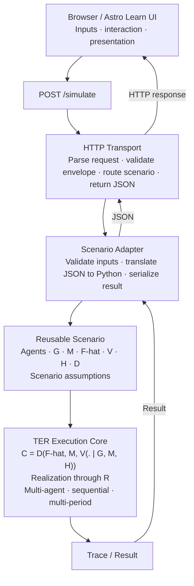

# Theory of Economic Relativity — website

The public TER website and its Learn interface, built with Astro. Interactive
Learn scenarios run in a small Python simulator that executes the TER core in
`research/`.

## Local development

Requirements: Node.js 22.12+ with npm, and Python 3.14.

Install dependencies once, from `applications/web`:

```bash
npm install
```

Start the simulator and the website together from the repository root;
Ctrl+C stops both:

```bash
./scripts/dev-simulator.sh
```

- Simulator: `http://127.0.0.1:8000`
- Website: `http://localhost:4321`

For frontend-only work, run Astro alone from `applications/web`. Interactive
scenarios then show an endpoint error.

```bash
npm run dev
```

## Validation and build

From `applications/web`:

```bash
npm run check   # Astro and TypeScript checks
npm run build   # check, then static build into dist/
```

## Simulator architecture

```text
browser → POST /simulate → scenario adapter → scenario → TER core
```

- Python owns the executable economics, including defaults and action
  selection.
- The browser owns interaction and presentation. It must not duplicate TER
  decision logic.

The page posts `{"scenario": "basic-agent-choice", "inputs": {...}}` to
`PUBLIC_TER_API_URL` + `/simulate`. Empty `inputs` runs the Python defaults.
`PUBLIC_TER_API_URL` is read at build time and defaults to
`http://127.0.0.1:8000`.

## Production

The static deployment does not host the Python simulator, so interactive
scenarios do not work in production. A production `/simulate` Python
deployment is still required. Set `PUBLIC_TER_API_URL` (build time) to its HTTPS
endpoint and `TER_ALLOWED_ORIGIN` (on the simulator) to the exact HTTPS site
origin, such as `https://example.org`.

## Project map

```text
src/pages/learn/                                   Learn index and scenario pages
src/data/learn/scenarios.ts                        Learn scenario content
src/components/learn/                              Learn page components
src/components/learn/BasicAgentChoiceRunner.astro  Basic Agent Choice UI
src/pages/                                         Other site routes
src/styles/global.css                              Global styles

# Repository root
scripts/dev-simulator.sh                           Runs simulator and website
research/http/simulation.py                        POST /simulate server
research/adapters/basic_agent_choice.py            JSON adapter
research/scenarios/basic_agent_choice.py           Scenario definition
research/ter/                                      TER core
```


## TER SIMULATOR ARCHITECTURE


